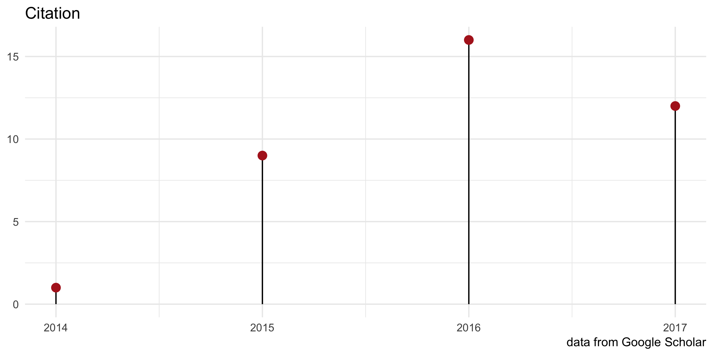
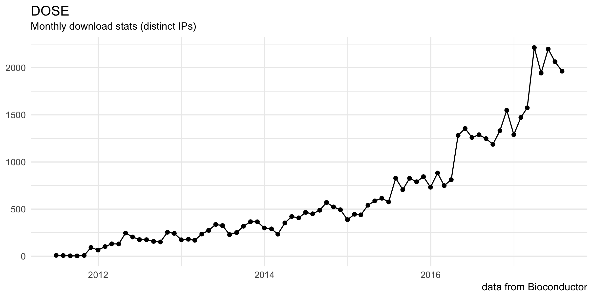

---
output:
  md_document:
    variant: markdown_github
html_preview: false
---


```{r echo=FALSE, results="hide", message=FALSE}
library("ypages")
library("ggplot2")
```


# DOSE: Disease Ontology Semantic and Enrichment analysis

`r badge_bioc_release("DOSE", "green")`
`r badge_devel("guangchuangyu/DOSE", "green")`
[](https://www.bioconductor.org/packages/devel/bioc/html/DOSE.html#since)
`r badge_bioc_download("DOSE", "total", "blue")`
`r badge_bioc_download("DOSE", "month", "blue")`


[](http://www.repostatus.org/#active)
[](https://codecov.io/gh/GuangchuangYu/DOSE/)
[)`-green.svg)](https://github.com/GuangchuangYu/DOSE/commits/master)
[](https://www.bioconductor.org/packages/devel/bioc/html/DOSE.html#svn_source)
[](https://github.com/GuangchuangYu/DOSE/network)
[](https://github.com/GuangchuangYu/DOSE/stargazers)


[](https://www.bioconductor.org/packages/devel/bioc/html/DOSE.html#archives)
[](https://bioconductor.org/checkResults/devel/bioc-LATEST/DOSE/)
[](https://travis-ci.org/GuangchuangYu/DOSE)
[](https://ci.appveyor.com/project/GuangchuangYu/DOSE)
[](http://bioconda.github.io/recipes/bioconductor-dose/README.html)


This package implements five methods proposed by *Resnik*, *Schlicker*, *Jiang*, *Lin* and *Wang* respectively for measuring semantic similarities among DO terms and gene products. Enrichment analyses including hypergeometric model and gene set enrichment analysis are also implemented for discovering disease associations of high-throughput biological data.


For details, please visit our project website, <https://guangchuangyu.github.io/DOSE>.

+ [Documentation](https://guangchuangyu.github.io/DOSE/documentation/)
+ [Featured Articles](https://guangchuangyu.github.io/DOSE/featuredArticles/)
+ [Feedback](https://guangchuangyu.github.io/DOSE/#feedback)


[](https://twitter.com/intent/tweet?hashtags=DOSE&url=http://bioinformatics.oxfordjournals.org/content/31/4/608)

------------------------------------------------------------------------

Please cite the following article when using `DOSE`:

__*G Yu*__, LG Wang, GR Yan, QY He. DOSE: an R/Bioconductor package for Disease Ontology Semantic and Enrichment analysis. __*Bioinformatics*__ 2015, 31(4):608-609.

`r badge_doi("10.1093/bioinformatics/btu684", "green")`
`r badge_altmetric("2788597", "green")`


------------------------------------------------------------------------


### Citation

`r badge_citation("Ug5p-4gJ2f0C", "16627502277303919270", "green")`
`r badge_custom("ESI", "Highly Cited Paper", "green")`


```{r echo=F, comment=NA}
d <- get_article_cite_history('DO5oG40AAAAJ', 'Ug5p-4gJ2f0C')
## txtplot(d$year, d$cites)
## library("ggalt")
## p <- ggplot(d, aes(year, cites)) + geom_lollipop(point.size=3, point.colour='firebrick') +
p <- ggplot(d, aes(year, cites)) + geom_segment(aes(xend=year, yend=0)) + geom_point(size=3, color='firebrick') +
    theme_minimal() + xlab(NULL) + ylab(NULL) + labs(title="Citation", caption="data from Google Scholar")
ggsave(p, file="docs/citation.png", width=8, height=4)
```





### Download stats

`r badge_download_bioc("DOSE")`
`r badge_bioc_download("DOSE", "total", "blue")`
`r badge_bioc_download("DOSE", "month", "blue")`


```{r echo=F, message=F, comment=NA}
x <- dlstats::bioc_stats("DOSE")
x <- x[-nrow(x), ] # last month data is not complete
## txtplot(ggtree::Date2decimal(x$end), x$Nb_of_downloads, width=100, height=25)
p <- ggplot(x, aes(end, Nb_of_distinct_IPs)) + geom_point() + geom_line() +
    theme_minimal() +xlab(NULL) + ylab(NULL) +
    labs(title="DOSE", subtitle="Monthly download stats (distinct IPs)", caption="data from Bioconductor")
ggsave(p, file="docs/dlstats.png", width=8, height=4)
```




