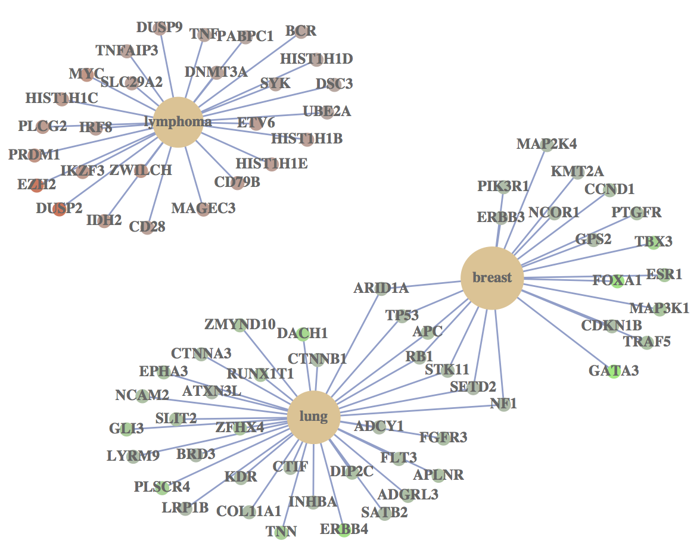
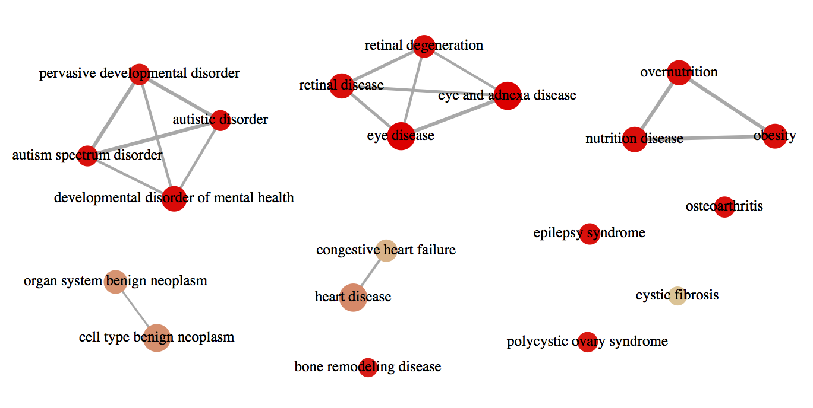

```{r style, echo=FALSE, results="asis", message=FALSE}
BiocStyle::markdown()
knitr::opts_chunk$set(tidy = FALSE,
                      warning = FALSE,
                      message = FALSE)
```

```{r echo=FALSE, results='hide', message=FALSE}
library(DOSE)
library(org.Hs.eg.db)
library(clusterProfiler)
```

# GSEA algorithm

A common approach in analyzing gene expression profiles was identifying differential expressed genes that are deemed interesting. The enrichment analysis we demonstrated in [Disease enrichment analysis](enrichmentAnalysis.html) vignette were based on these differential expressed genes. This approach will find genes where the difference is large, but it will not detect a situation where the difference is small, but evidenced in coordinated way in a set of related genes. Gene Set Enrichment Analysis (GSEA)[@subramanian_gene_2005] directly addresses this limitation. 
All genes can be used in GSEA; GSEA aggregates the per gene statistics across genes within a gene set, therefore making it possible to detect situations where all genes in a predefined set change in a small but coordinated way. Since it is likely that many relevant phenotypic differences are manifested by small but consistent changes in a set of genes.

Genes are ranked based on their phenotypes. Given a priori defined set of gens _S_ (e.g., genes shareing the same _DO_ category), the goal of GSEA is to determine whether the members of _S_ are randomly distributed throughout the ranked gene list (_L_) or primarily found at the top or bottom.

There are three key elements of the GSEA method:

* Calculation of an Enrichment Score.
  + The enrichment score (_ES_) represent the degree to which a set _S_ is over-represented at the top or bottom of the ranked list _L_. The score is calculated by walking down the list _L_, increasing a running-sum statistic when we encounter a gene in _S_ and decreasing when it is not. The magnitude of the increment depends on the gene statistics (e.g., correlation of the gene with phenotype). The _ES_ is the maximum deviation from zero encountered in the random walk; it corresponds to a weighted Kolmogorov-Smirnov-like statistic[@subramanian_gene_2005].
* Esimation of Significance Level of _ES_.
  + The _p_-value of the _ES_ is calculated using permutation test. Specifically, we permute the gene labels of the gene list _L_ and recompute the _ES_ of the gene set for the permutated data, which generate a null distribution for the _ES_. The _p_-value of the observed _ES_ is then calculated relative to this null distribution.
* Adjustment for Multiple Hypothesis Testing.
  + When the entire gene sets were evaluated, `r Biocpkg("DOSE")` adjust the estimated significance level to account for multiple hypothesis testing and also _q_-values were calculated for FDR control.

We implemented GSEA algorithm proposed by Subramanian[@subramanian_gene_2005]. Alexey Sergushichev implemented an algorithm for fast GSEA analysis in the `r Biocpkg("fgsea")`[@alex_fgsea] package. 

In `r Biocpkg("DOSE")`[@yu_dose_2015], user can use GSEA algorithm implemented in `DOSE` or `fgsea` by specifying the parameter `by="DOSE"` or `by="fgsea"`. By default, `r Biocpkg("DOSE")` use `fgsea` since it is much more fast.


## Leading edge analysis and core enriched genes

Leading edge analysis reports `Tags` to indicate the percentage of genes contributing to the enrichment score, `List` to indicate where in the list the enrichment score is attained and `Signal` for enrichment signal strength.

It would also be very interesting to get the core enriched genes that contribute to the enrichment. 

`r Biocpkg("DOSE")` supports leading edge analysis and report core enriched genes in GSEA analysis.

## `gseDO` fuction

In the following example, in order to speedup the compilation of this document, only gene sets with size above 120 were tested and only 100 permutations were performed. 

```{r}
library(DOSE)
data(geneList)
y <- gseDO(geneList,
           nPerm         = 100, 
           minGSSize     = 120,
           pvalueCutoff  = 0.2, 
           pAdjustMethod = "BH",
           verbose       = FALSE)
head(y, 3)
```

## `gseNCG` fuction

```{r}
ncg <- gseNCG(geneList,
              nPerm         = 100, 
              minGSSize     = 120,
              pvalueCutoff  = 0.2, 
              pAdjustMethod = "BH",
              verbose       = FALSE)
ncg <- setReadable(ncg, 'org.Hs.eg.db')
head(ncg, 3)
```

## `gseDGN` fuction

```{r}
dgn <- gseDGN(geneList,
              nPerm         = 100, 
              minGSSize     = 120,
              pvalueCutoff  = 0.2, 
              pAdjustMethod = "BH",
              verbose       = FALSE)
dgn <- setReadable(dgn, 'org.Hs.eg.db')
head(dgn, 3)
```

# Visualization

## cnetplot

```{r fig.width=18, fig.height=18, eval=FALSE}
cnetplot(ncg, categorySize="pvalue", foldChange=geneList)
```




## enrichMap

```{r fig.height=10, fig.width=10, eval=FALSE}
enrichMap(y, n=20)
```



## gseaplot

```{r fig.height=6, fig.width=8}
gseaplot(y, geneSetID = y$ID[1], title=y$Description[1])
```


# References
