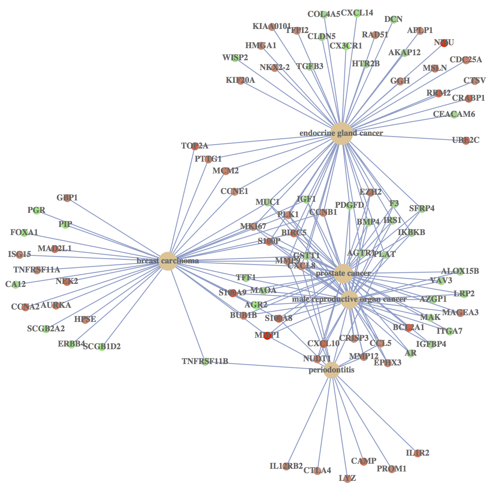
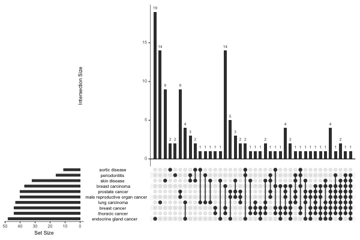
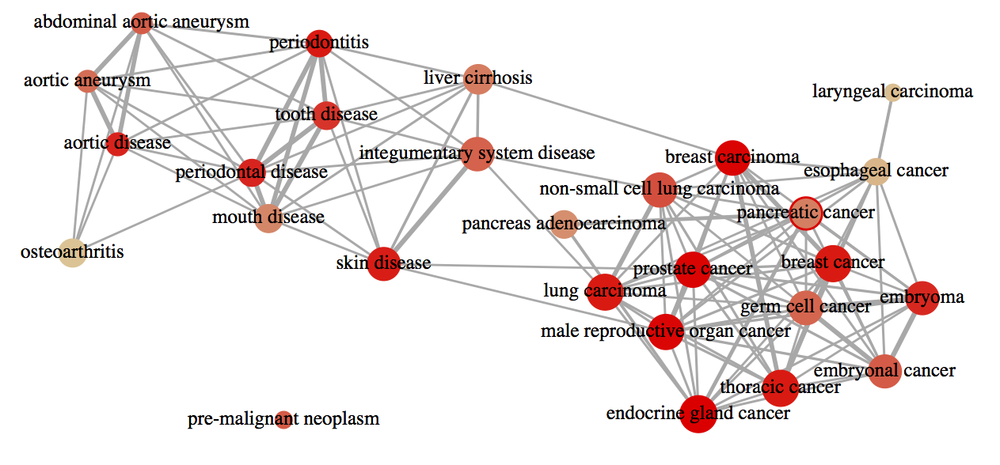

```{r style, echo=FALSE, results="asis", message=FALSE}
BiocStyle::markdown()
knitr::opts_chunk$set(tidy = FALSE,
                      warning = FALSE,
                      message = FALSE)
```

```{r echo=FALSE, results='hide', message=FALSE}
library(DOSE)
library(org.Hs.eg.db)
library(clusterProfiler)
```

# The `geneList` dataset

`r Biocpkg("DOSE")` provides an example dataset `geneList` which was derived from `R` package `r Biocpkg("breastCancerMAINZ")` that contained 200 samples, including 29 samples in grade I, 136 samples in grade II and 35 samples in grade III. We computed the ratios of geometric means of grade III samples versus geometric means of grade I samples. Logarithm of these ratios (base 2) were stored in `geneList` dataset.


# Over-representation analysis

Over-representation test[@boyle2004] is a widely used approach to identify biological themes.
`r Biocpkg("DOSE")` implements hypergeometric model to assess whether the number of selected genes associated with disease is larger than expected.

To determine whether any terms annotate a specified list of genes at frequency greater than that would be expected by chance, `r Biocpkg("DOSE")` calculates a _p_-value using the hypergeometric distribution:

$p = 1 - \displaystyle\sum_{i = 0}^{k-1}\frac{{M \choose i}{{N-M} \choose {n-i}}} {{N \choose n}}$

In this equation, `N` is the total number of genes in the background distribution,
`M` is the number of genes within that distribution that are annotated (either directly or indirectly) to the
node of interest,
`n` is the size of the list of genes of interest and `k` is the number of genes within that list which
are annotated to the node. The background distribution by default is
all the genes that have annotation. User can set the background via `universe` parameter.

_P_-values were adjusted for multiple comparison, and _q_-values were also calculated for FDR control.


## `enrichDO` function

In the following example, we selected fold change above 1 as the differential genes and analyzing their disease association.

```{r}
library(DOSE)
data(geneList)
gene <- names(geneList)[abs(geneList) > 1.5]
head(gene)
x <- enrichDO(gene          = gene,
              ont           = "DO",
              pvalueCutoff  = 0.05,
              pAdjustMethod = "BH",
              universe      = names(geneList),
              minGSSize     = 5,
              maxGSSize     = 500,
              qvalueCutoff  = 0.05,
              readable      = FALSE)
head(x)
```

The `enrichDO` function requires an entrezgene ID vector as input, mostly is the differential gene list of gene expression profile studies. If user needs to convert other gene ID type to entrezgene ID, we recommend using `bitr` function provided by `r Biocpkg("clusterProfiler")`.

The `ont` parameter can be "DO" or "DOLite", DOLite[@Du15062009] was constructed to aggregate the redundant DO terms. The DOLite data is not updated, we recommend user use `ont="DO"`. `pvalueCutoff` setting the cutoff value of *p* value and *p* value adjust; `pAdjustMethod` setting the *p* value correction methods, include the Bonferroni correction ("bonferroni"), Holm ("holm"), Hochberg ("hochberg"), Hommel ("hommel"), Benjamini \& Hochberg ("BH") and Benjamini \& Yekutieli ("BY") while `qvalueCutoff` is used to control *q*-values.

The `universe` setting the background gene universe for testing. If user do not explicitly setting this parameter, `enrichDO` will set the universe to all human genes that have DO annotation.

The `minGSSize` (and `maxGSSize`) indicates that only those DO terms that have more than `minGSSize` (and less than `maxGSSize`) genes annotated will be tested.

The `readable` is a logical parameter, indicates whether the entrezgene IDs will mapping to gene symbols or not.

We also implement `setReadable` function that helps the user to convert entrezgene IDs to gene symbols.

```{r}
x <- setReadable(x, 'org.Hs.eg.db')
head(x)
```

## `enrichNCG` function

[Network of Cancer Gene](http://ncg.kcl.ac.uk/) (NCG)[@omer_ncg] is a manually curated repository of cancer genes. NCG release 5.0 (Aug. 2015) collects 1,571 cancer genes from 175 published studies. `r Biocpkg("DOSE")` supports analyzing gene list and determine whether they are enriched in genes known to be mutated in a given cancer type.

```{r}
gene2 <- names(geneList)[abs(geneList) < 3]
ncg <- enrichNCG(gene2)
head(ncg)
```

## `enrichDGN` and `enrichDGNv` functions

[DisGeNET](http://disgenet.org/)[@janet_disgenet] is an integrative and comprehensive resources of gene-disease associations from several public data sources and the literature. It contains gene-disease associations and snp-gene-disease associations.

The enrichment analysis of disease-gene associations is supported by the `enrichDGN` function and analysis of snp-gene-disease associations is supported by the `enrichDGNv` function.

```{r}
dgn <- enrichDGN(gene)
head(dgn)

snp <- c("rs1401296", "rs9315050", "rs5498", "rs1524668", "rs147377392",
         "rs841", "rs909253", "rs7193343", "rs3918232", "rs3760396",
         "rs2231137", "rs10947803", "rs17222919", "rs386602276", "rs11053646",
         "rs1805192", "rs139564723", "rs2230806", "rs20417", "rs966221")
dgnv <- enrichDGNv(snp)
head(dgnv)
```


# Visualze enrichment result

To help interpreting enrichment result, we implemented `barplot`, `dotplot`, `cnetplot` (category-gene-network) `upsetplot` and `enrichMap` for visualization.

## barplot

```{r fig.height=6, fig.width=7}
barplot(x, showCategory=10)
```

## dotplot

[dotplot](http://guangchuangyu.github.io/2015/06/dotplot-for-enrichment-result/) is a good alternative to `barplot`.

```{r fig.width=6}
dotplot(x)
```

## cnetplot

In order to consider the potentially biological complexities in which a gene may belong to multiple annotation categories, we developed `cnetplot` function to extract the complex association between genes and diseases.

```{r fig.width=18, fig.height=18, eval=FALSE}
cnetplot(x, categorySize="pvalue", foldChange=geneList)
```




## upsetplot

`upsetplot` is an alternative to `cnetplot` for visualizing the complex association between genes and diseases.

```{r fig.width=10, fig.height=6, eval=FALSE}
upsetplot(x)
```



## enrichMap

Enrichment Map can be visualized by `enrichMap` function. It's designed to summarize enriched result.

```{r fig.height=10, fig.width=10, eval=FALSE}
enrichMap(x)
```




# Disease analysis of NGS data

Disease analysis using NGS data (eg, RNA-Seq and ChIP-Seq) can be performed by linking coding and non-coding regions to coding genes via `r Biocpkg("ChIPseeker")` package, which can annotates genomic regions to their nearest genes, host genes, and flanking genes respectivly. In addtion, it provides a function, `seq2gene`, that simultaneously considering host genes, promoter region and flanking gene from intergenic region that may under control via cis-regulation. This function maps genomic regions to genes in a many-to-many manner and facilitate functional analysis. For more details, please refer to `r Biocpkg("ChIPseeker")`[@yu_chipseeker_2015].


# Disease association comparison

We have developed an `R` package `r Biocpkg("clusterProfiler")`[@yu_clusterprofiler_2012] for comparing biological themes among gene clusters.
`r Biocpkg("DOSE")` works fine with `r Biocpkg("clusterProfiler")` and can compare biological themes at disease perspective.

```{r fig.width=7, fig.height=7}
library(clusterProfiler)
data(gcSample)
cdo <- compareCluster(gcSample, fun="enrichDO")
plot(cdo)
```

# Other enrichment analysis tools

We provide enrichment analysis in `r
Biocpkg("clusterProfiler")`[@yu_clusterprofiler_2012] for GO, KEGG,
DAVID, Molecular Signatures Database and others (user's annotation),
`r Biocpkg("meshes")` for MeSH enrichment analysis and Reactome pathway enrichment analysis in `r Biocpkg("ReactomePA")`[@yu_reactomepa_2016] package. Both hypergeometric test and GSEA are supported.


# References
